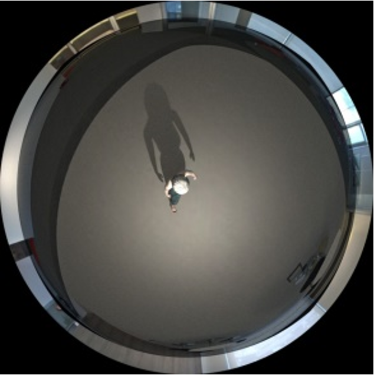
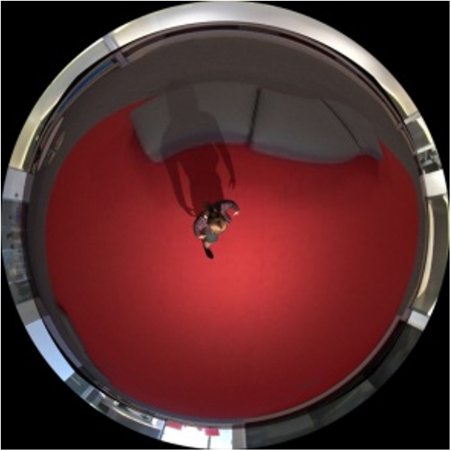
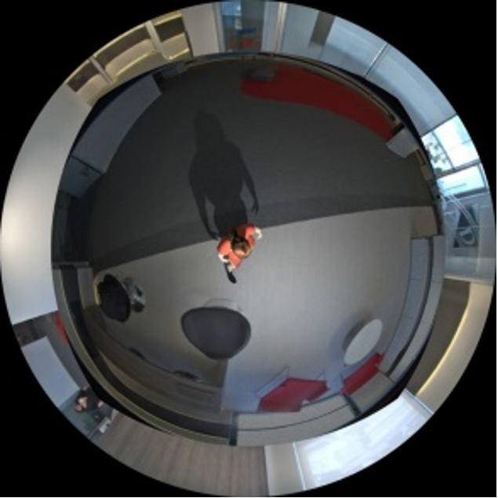

# Synthetic Data Generation - Fish-Eye Camera
The generation of "Synthetic Data Set(Humman images with light, shadow on random background)" by using 3D human shape model with respect to the body pose and textured background by using Fish-Eye Camera. 
The Synthetic data cover all relevant variations (motion of human model).
# Setup
### [Blender](https://www.blender.org/)
For the setup of Camera, Light, random background etc and generation of Human Data-Set.
### [MakeHuman](http://www.makehumancommunity.org/)
- Install [9_export_mhx2](https://bitbucket.org/Diffeomorphic/mhx2-makehuman-exchange) add-on.  
- Design your human.
- In Pose/Animate --> Skeleton select any but "None" (Skeleton should match the one used in the bvh-motion-file).
- In MakeHumans export window select "Feet on ground" and "Poses" and set scale units to meter.
###### Note: Object needs a skeleton, otherwise script might fail.
### Generation of Human-Data Set by using Blender
- Install import_runtime_mhx2[1] to import MakeHuman models in Blender 2.7x.
- Add the directory containing the attached py-files to the environment variable `PYTHONPATH`(`PYTHONPATH` needs to be set otherwise local imports cannot be found.)
- GUI-Mode
    - Execute `blender`.
    - The MakeHuman eXchange format 2 (MHX2) is used to load persons into Blender.
    - Make sure the MakeWalk and Import-Runtime MakeHuman add-ons are enabled (File -> User Preferences...).
    - Load `generateImagesWithPlane.py` in Blender's text editor, modify the object path and excude `Run Script`.
- Headless Mode
    - `blender -b -P generateImagesWithPlane.py`.
# Result
Images Generated by Blender with the help of python Script.  
  
  

